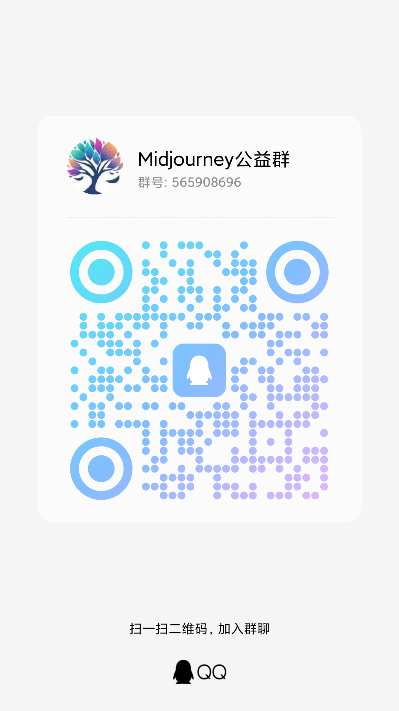

# Midjourney API

A public project offering a free drawing API that proxies Midjourney's Discord channel, supporting one-click face swapping for images and videos.

The most powerful, comprehensive, full-featured, and completely free open-source Midjourney API project available.

**English** | [中文](README.md)

The most powerful, complete, full-featured, and completely free open-source Midjourney API project on the market.

It proxies Midjourney’s Discord channel to generate images via the API, supporting one-click face swapping for images and videos, providing free drawing interfaces as a public project.

🦄 As of September 2024, user feedback indicates over 10 million images generated using this project 🐂, with over 200,000 images generated daily!

⭐ If you like this project, please give it a `Star`—thank you so much!

## Community Group

If you have any questions regarding usage or deployment, feel free to join the community group to discuss and solve issues together.

For drawing requests, contact group admins. Everyone in the group is highly skilled!

[Midjourney Group](https://qm.qq.com/q/k88clCkyMS) (QQ Group: 565908696)



## Main Features

- [x] Supports the Imagine command and related actions [V1/V2.../U1/U2.../R]
- [x] Supports adding base64 images during Imagine as a reference image
- [x] Supports Blend (image mixing), Describe (image-to-text), and Shorten (prompt analysis) commands
- [x] Real-time task progress tracking
- [x] Supports Chinese prompt translation, requiring Baidu or GPT translation configuration
- [x] Prompt sensitivity pre-detection with override options
- [x] User token connects to WSS for error and full feature access
- [x] Supports Shorten (prompt analysis) command
- [x] Supports focus shift: Pan ⬅️➡⬆️⬇️
- [x] Supports partial redraw: Vary (Region) 🖌
- [x] Supports all related button actions
- [x] Supports image zoom and custom zoom Zoom 🔍
- [x] Retrieve image seed values
- [x] Supports account-specific speed modes RELAX | FAST | TURBO
- [x] Multi-account configuration with customizable task queues, supporting account selection modes BestWaitIdle | Random | Weight | Polling
- [x] Persistent account pool with dynamic maintenance
- [x] Retrieve account /info, /settings details
- [x] Account settings customization
- [x] Supports niji・journey Bot and Midjourney Bot
- [x] Safe compression using zlib-stream <https://discord.com/developers/docs/topics/gateway>
- [x] Embedded MJ management page, multi-language support <https://github.com/trueai-org/midjourney-proxy-webui>
- [x] Full CRUD functionality for MJ accounts
- [x] Support detailed information inquiry and account synchronization operations for MJ accounts
- [x] Support concurrent queue settings for MJ accounts
- [x] Configurable account concurrency settings
- [x] Full task query functionality for MJ
- [x] Provides a fully functional drawing test page
- [x] Compatible with mainstream drawing clients and API calls
- [x] Task includes parent task information
- [x] 🎛️ Remix mode and automatic Remix mode submission
- [x] Built-in image saving to local storage, built-in CDN acceleration
- [x] Auto-read unread messages during drawing when too many are queued
- [x] Supports PicReader, Picread commands for image-to-text, with batch regeneration support (no fast mode needed)
- [x] BOOKMARK command support
- [x] Supports instance-specific drawing, filtering accounts by speed, remix mode, etc. See Swagger `accountFilter` field for details
- [x] Reverse task generation from job ID or image
- [x] Account sorting, parallelism, queue configuration, task interval settings
- [x] Supports client path specification, with default URLs like https://{BASE_URL}/mj/submit/imagine, /mj-turbo/mj for turbo mode, /mj-relax/mj for relax mode, /mj-fast/mj for fast mode, /mj without mode specification
- [x] CloudFlare manual human verification, auto-lock account upon trigger, verify via GUI or email notification
- [x] CloudFlare automatic human verification, configurable verification server address (auto-verifier only supports Windows deployment)
- [x] Work schedule configuration; 24/7 drawing may trigger warnings. Recommended rest: 8–10 hours, e.g., `09:10-23:55, 13:00-08:10`
- [x] Built-in IP rate limiting, IP range limiting, blacklists, whitelists, automatic blacklisting
- [x] Daily drawing limit, after which new tasks aren’t accepted but modifications and redrawing are still allowed
- [x] Registration and guest access toggle
- [x] Visual configuration functionality
- [x] Independent Swagger documentation toggle
- [x] Optional configuration of bot token, non-bot usage possible
- [x] Command and status progress display optimization
- [x] Leisure time configuration; accounts have relaxed mode to avoid high-frequency tasks (no new drawings, but other commands can be executed, configurable for multiple time slots)
- [x] Vertical categorization of accounts; each account can specialize in specific types of art, e.g., only landscapes, only portraits
- [x] Shared channels or sub-channels for drawing; even if an account is banned, previous drawings can continue using the banned account's channel as a sub-channel, with permanent invite and sub-channel links. Batch modification supported.
- [x] Supports local databases, MongoDB, etc. If task data exceeds 100,000 entries, MongoDB storage is recommended (default retention of 1,000,000 records), with auto data migration support.
- [x] Supports one-click migration from `mjplus` or other services, including account and task migration
- [x] Built-in prohibited word management with multi-term grouping
- [x] Auto-convert unofficial links in prompts to official ones, allowing for domestic or custom reference links to avoid verification issues.
- [x] Auto-switch to slow mode when fast mode time runs out, with customizable enablement. Automatically restores fast mode upon purchase or renewal.
- [x] Supports image storage to Alibaba Cloud OSS, custom CDN, custom styles, and thumbnails (OSS is recommended for faster loading, separated from the source site)
- [x] Supports Shorten analysis of Prompt for image regeneration commands
- [x] Supports face-swapping for images, in compliance with relevant laws and regulations
- [x] Supports face-swapping for videos, in compliance with relevant laws and regulations
- [x] Auto-switch between slow and fast modes, and auto-setup of slow mode
- [x] Auto-fetch of private message ID upon service startup, no configuration required

## Online Preview

The public interface runs in slow mode, with free API access. The account pool is sponsored; please use responsibly.

- Admin panel: <https://ai.trueai.org>
- Account password: `None`
- Public API: <https://ai.trueai.org/mj>
- API documentation: <https://ai.trueai.org/swagger>
- API key: `None`
- CloudFlare automatic verification server: <http://47.76.110.222:8081>
- CloudFlare automatic verification server documentation: <http://47.76.110.222:8081/swagger>

## Preview Screenshots


## Recommended Clients

- **ChatGPT Midjourney**: <https://github.com/Licoy/ChatGPT-Midjourney>
  - Instantly set up your own ChatGPT+StabilityAI+Midjourney web service -> <https://aidemo.xiazai.zip/#/mj>
  - Open the site -> Settings -> Custom API -> Model (Midjourney) -> API URL -> <https://ai.trueai.org/mj>

- **ChatGPT Web Midjourney Proxy**: <https://github.com/Dooy/chatgpt-web-midjourney-proxy> 
  - Open the site <https://vercel.ddaiai.com> -> Settings -> MJ Drawing API URL -> <https://ai.trueai.org>

- **GoAmzAI**: <https://github.com/Licoy/GoAmzAI>
  - Open the admin panel -> Drawing management -> Add new -> MJ Drawing API URL -> <https://ai.trueai.org/mj>

## Installation and Usage

> Note: If you are deploying privately, make sure to disable demo mode, registration, and guest access to prevent API misuse.

> Note: For the Windows platform, simply download and launch directly. See the instructions below for details.

### Quick Start

> Docker Version

- [Bilibili Midjourney API Docker Deployment Video Tutorial](https://www.bilibili.com/video/BV1NQpQezEu4/)
- [Douyin Midjourney API Docker Deployment Video Tutorial](https://v.douyin.com/irvnDGfo/)

Note: Ensure the file mappings and paths are correct ⚠

```bash
# Automatic installation and startup
# Recommended to use the one-click upgrade script
# 1. First-time download (after downloading, you can edit this script to customize configurations such as path, port, memory, etc. The default port is 8086)
wget -O docker-upgrade.sh https://raw.githubusercontent.com/trueai-org/midjourney-proxy/main/scripts/docker-upgrade.sh && bash docker-upgrade.sh

# 2. To update/upgrade in the future, simply run this script
sh docker-upgrade.sh
```

```bash
# Manual installation and startup
# Alibaba Cloud Mirror (Recommended for users in China)
docker pull registry.cn-guangzhou.aliyuncs.com/trueai-org/midjourney-proxy

# 1. Download and rename the configuration file (sample config)
# Note: Version 3.x no longer requires a configuration file
# wget -O /root/mjopen/appsettings.Production.json https://raw.githubusercontent.com/trueai-org/midjourney-proxy/main/src/Midjourney.API/appsettings.json
# curl -o /root/mjopen/appsettings.Production.json https://raw.githubusercontent.com/trueai-org/midjourney-proxy/main/src/Midjourney.API/appsettings.json

# 2. Stop and remove the old Docker container
docker stop mjopen && docker rm mjopen

# 3. Start the container
docker run --name mjopen -d --restart=always \
 -p 8086:8080 --user root \
 -v /root/mjopen/logs:/app/logs:rw \
 -v /root/mjopen/data:/app/data:rw \
 -v /root/mjopen/attachments:/app/wwwroot/attachments:rw \
 -v /root/mjopen/ephemeral-attachments:/app/wwwroot/ephemeral-attachments:rw \
 -e TZ=Asia/Shanghai \
 -v /etc/localtime:/etc/localtime:ro \
 -v /etc/timezone:/etc/timezone:ro \
 registry.cn-guangzhou.aliyuncs.com/trueai-org/midjourney-proxy

# GitHub Mirror
docker pull ghcr.io/trueai-org/midjourney-proxy
docker run --name mjopen -d --restart=always \
 -p 8086:8080 --user root \
 -v /root/mjopen/logs:/app/logs:rw \
 -v /root/mjopen/data:/app/data:rw \
 -v /root/mjopen/attachments:/app/wwwroot/attachments:rw \
 -v /root/mjopen/ephemeral-attachments:/app/wwwroot/ephemeral-attachments:rw \
 -e TZ=Asia/Shanghai \
 -v /etc/localtime:/etc/localtime:ro \
 -v /etc/timezone:/etc/timezone:ro \
 ghcr.io/trueai-org/midjourney-proxy

# DockerHub Mirror
docker pull trueaiorg/midjourney-proxy
docker run --name mjopen -d --restart=always \
 -p 8086:8080 --user root \
 -v /root/mjopen/logs:/app/logs:rw \
 -v /root/mjopen/data:/app/data:rw \
 -v /root/mjopen/attachments:/app/wwwroot/attachments:rw \
 -v /root/mjopen/ephemeral-attachments:/app/wwwroot/ephemeral-attachments:rw \
 -e TZ=Asia/Shanghai \
 -v /etc/localtime:/etc/localtime:ro \
 -v /etc/timezone:/etc/timezone:ro \
 trueaiorg/midjourney-proxy
```

> Windows Version

```bash
a. Download the latest portable version for Windows from https://github.com/trueai-org/midjourney-proxy/releases, for example: midjourney-proxy-win-x64.zip
b. Extract and run Midjourney.API.exe
c. Open the site at http://localhost:8080
d. (Optional) Deploy to IIS: Add the folder as a website in IIS and configure the application pool to "No Managed Code" and start the website.
e. (Optional) Use the built-in "Task Scheduler" to create a basic task, select the .exe file, and ensure only one task instance is running at a time.
```

> Linux Version

```bash
a. Download the latest portable version for Linux from https://github.com/trueai-org/midjourney-proxy/releases, for example: midjourney-proxy-linux-x64.zip
b. Extract the contents: tar -xzf midjourney-proxy-linux-x64-<VERSION>.tar.gz
c. To run: execute the run_app.sh script
c. Start method 1: sh run_app.sh
d. Start method 2: chmod +x run_app.sh && ./run_app.sh
```

> macOS Version

```bash
a. Download the latest portable version for macOS from https://github.com/trueai-org/midjourney-proxy/releases, for example: midjourney-proxy-osx-x64.zip
b. Extract the contents: tar -xzf midjourney-proxy-osx-x64-<VERSION>.tar.gz
c. To run: execute the run_app_osx.sh script
c. Start method 1: sh run_app_osx.sh
d. Start method 2: chmod +x run_app_osx.sh && ./run_app_osx.sh
```

> Linux One-Click Install Script (❤ Thanks to [@dbccccccc](https://github.com/dbccccccc))

```bash
# Method 1
wget -N --no-check-certificate https://raw.githubusercontent.com/trueai-org/midjourney-proxy/main/scripts/linux_install.sh && chmod +x linux_install.sh && bash linux_install.sh

# Method 2
curl -o linux_install.sh https://raw.githubusercontent.com/trueai-org/midjourney-proxy/main/scripts/linux_install.sh && chmod +x linux_install.sh && bash linux_install.sh
```

## Configuration Parameters

[More configuration parameters documentation](./docs/appsettings.md)

- `appsettings.json` Default Configuration
- `appsettings.Production.json` Production Environment Configuration
- `/app/data` Data directory, stores accounts, tasks, etc.
    - `/app/data/mj.db` Database file
- `/app/logs` Log directory
- `/app/wwwroot` Static file directory
    - `/app/wwwroot/attachments` Directory for drawing files
    - `/app/wwwroot/ephemeral-attachments` Directory for images generated by the describe command

#### Role Explanation

- `Regular User`: Can only access the drawing interface, cannot access the admin panel.
- `Admin`: Can log into the admin panel to view tasks, configuration, etc.

#### Default Users

- On first launch, the default admin token is: `admin`. Please reset the token after logging in.

#### Alibaba Cloud OSS Configuration

```json
{
  "enable": true,
  "bucketName": "mjopen",
  "region": null,
  "accessKeyId": "LTAIa***",
  "accessKeySecret": "QGqO7***",
  "endpoint": "oss-cn-hongkong-internal.aliyuncs.com",
  "customCdn": "https://mjcdn.googlec.cc",
  "imageStyle": "x-oss-process=style/webp",
  "thumbnailImageStyle": "x-oss-process=style/w200"
}
```

#### MongoDB Configuration

> If your task volume is expected to exceed 100,000 in the future, it is recommended to deploy MongoDB using Docker.

> Note:
> 1. Switching to MongoDB allows for optional migration of historical tasks.
> 2. Various methods are available for specifying the IP, including internal IP, external IP, or container communication.

1. Start the container, with `xxx` as your password.
2. Open system settings -> Enter the MongoDB connection string `mongodb://mongoadmin:xxx@ip`.
3. Enter the MongoDB database name -> `mj` -> Save.
4. Restart the service.

```bash
# Start the container
docker run -d \
  --name mjopen-mongo \
  -p 27017:27017 \
  -v /root/mjopen/mongo/data:/data/db \
  --restart always \
  -e MONGO_INITDB_ROOT_USERNAME=mongoadmin \
  -e MONGO_INITDB_ROOT_PASSWORD=xxx \
  mongo

# Create the database (optional, can also be done via BT)
```

#### Face Swap Configuration

- Register on the official website and copy the Token: https://replicate.com/codeplugtech/face-swap

```json
{
  "token": "****",
  "enableFaceSwap": true,
  "faceSwapVersion": "278a81e7ebb22db98bcba54de985d22cc1abeead2754eb1f2af717247be69b34",
  "faceSwapCoreSize": 3,
  "faceSwapQueueSize": 10,
  "faceSwapTimeoutMinutes": 10,
  "enableVideoFaceSwap": true,
  "videoFaceSwapVersion": "104b4a39315349db50880757bc8c1c996c5309e3aa11286b0a3c84dab81fd440",
  "videoFaceSwapCoreSize": 3,
  "videoFaceSwapQueueSize": 10,
  "videoFaceSwapTimeoutMinutes": 30,
  "maxFileSize": 10485760,
  "webhook": null,
  "webhookEventsFilter": []
}
```

#### Banned Prompt Rate Limiting Configuration

- Configures the duration (in minutes) to block a user after `Banned prompt detected` is triggered `n` times in a day (excluding whitelisted users).

```json
{
  "enable": true,
  "rules": {
    "1": 60,
    "2": 120,
    "3": 600
  }
}
```

## CloudFlare CAPTCHA Verification

Free automatic CAPTCHA verification. Example configuration for CloudFlare auto-verification.

- `CaptchaServer`: Address of the verification server.
- `CaptchaNotifyHook`: Callback URL for notification upon verification completion, default is your domain.

```json
"CaptchaServer": "http://47.76.110.222:8081",
"CaptchaNotifyHook": "https://ai.trueai.org"
```

## CloudFlare Verifier

Only supports Windows deployment (TLS 1.3 supported, Windows 11 or Windows Server 2022 required). Since the CloudFlare verifier uses Chrome, it must be deployed on a Windows environment; Linux deployment is not supported due to dependencies on many libraries.

Note: You must provide a 2captcha.com API key for self-deployment, or it won't function. Pricing: 1000 verifications/9 CNY. Official website: <https://2captcha.cn/p/cloudflare-turnstile>

Tip: The first startup will download the Chrome browser, which may take some time. Please be patient.

> Example `appsettings.json` configuration:

```json
{
  "Demo": null, // Set website to demo mode
  "Captcha": {
    "Concurrent": 1, // Number of concurrent processes
    "Headless": true, // Whether to run Chrome in headless mode
    "TwoCaptchaKey": "" // API key for 2captcha.com
  },
  "urls": "http://*:8081" // Default port
}
```

## Bot Token (Optional Configuration)

This project uses the Discord Bot Token to connect to wss, providing error messages and full functionality to ensure high availability of messages.

[Bot Token Configuration Guide](./docs/en/api.md)

## Drawing Frequency Warning

- Task interval: 30–180 seconds, with a minimum of 3.6 seconds before execution.
- Daily limit: 200 drawings.
- Recommended daily working hours: 09:10–22:50.
- If multiple accounts are used, it is recommended to enable vertical field functionality, with each account focusing on a specific type of artwork.

## Support and Sponsorship

- If you find this project helpful, please give it a Star⭐.
- You can also provide temporarily idle public accounts for drawing (sponsoring one slow queue) to support the project's development 😀.
- If you have more ideas and creativity, feel free to submit PRs, Issues, or join discussions in the QQ group.

## Sponsors

Many thanks to the sponsors and community members for their help and support!

<a href="https://goapi.gptnb.ai"></a>
<a href="https://d.goamzai.com" target="_blank"></a>
<a href="https://api.ephone.ai" target="_blank"></a>
<a href="https://api.mjdjourney.cn" target="_blank"></a>
<a href="https://rixapi.com" target="_blank"></a>

## Security Policy

> Due to some open-source authors being subject to legal consequences, this project must not be used for illegal purposes.

- You must abide by national laws. Any illegal behavior is the sole responsibility of the user.
- This project follows the GPL license, allowing for personal and commercial use, but permission from the author is required, and copyright information must be retained.
- Please follow local laws and regulations; do not use for illegal purposes.
- Do not use for illegal activities.

## Star History

[](https://star-history.com/#trueai-org/midjourney-proxy&Date)