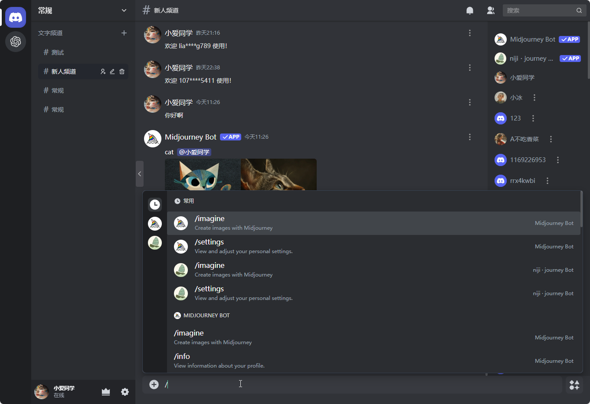
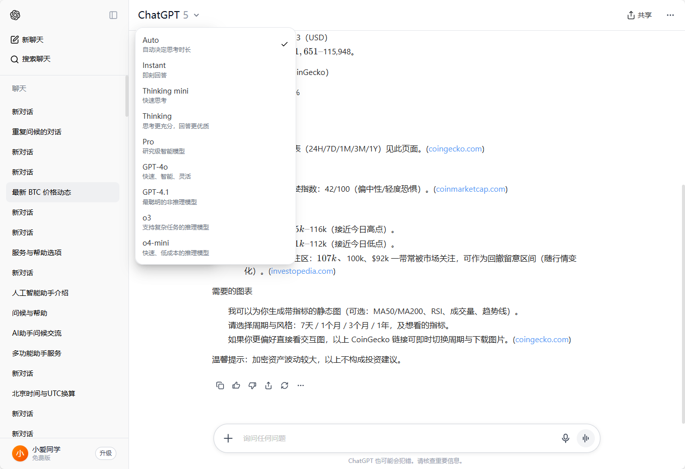

# Midjourney API

A public welfare project offering a free drawing API that proxies Midjourney's Discord channel, supporting one-click face swapping for images and videos.

The most powerful, complete, full-featured, completely free and open source Midjourney API project on the market.

**中文** | [English](README.en.md)

市面上最强大，最完整，功能最全面、完全免费开源的 Midjourney API 项目。

代理 Midjourney 的 Discord 频道，通过 API 绘图，支持图片、视频一键换脸，公益项目，提供免费绘图接口。

🦄 全球最大的 Midjourney 绘图 API，日绘图 100万+ 🐂！

⭐ 如果觉得项目不错，请一定帮忙点个 `Star`，万分感谢！

## 👍👍 ChatGPT · Discord · Midjourney 官方镜像站，官方 1 折优惠！

- 🍎 支持 Discord ChatGPT 所有指令！
- 😍 多端登录，不限设备，不限网络，永不封号！
- ☘ 只需一个域名，即刻拥有 ChatGPT Discord 官方镜像站！无需自己部署，无需服务器！

官网：<https://trueai.org>

企业注册：<https://admin.trueai.org>

更多官方镜像站接入指南：<https://trueai-org.feishu.cn/wiki/VvEZwL0X8i14wGkXcfrc85w7nFU>




## 交流群

如果使用上和部署上有什么疑问，欢迎加入交流群，一起讨论和解决问题。

如有绘图需求，欢迎加群联系群管理，群中皆是大佬！

[Midjourney公益群](https://qm.qq.com/q/k88clCkyMS)（QQ群：565908696）


## Midjourney 官网绘图接入文档

- https://trueai-org.feishu.cn/docx/ZDeUdPCBho4IE0xJHxpcXbdYnKd

## 悠船接入文档

- https://trueai-org.feishu.cn/docx/KrdIdOKm4otVmwxdv3AcLjsEnXf
 


## 主要功能

- [x] 支持 Discord 绘图。
- [x] 支持悠船绘图。
- [x] 支持官网 Midjourney 绘图。
- [x] 支持分布式部署。
- [x] 增加在线升级功能。
- [x] 增加在线重启功能。
- [x] 支持弹性部署，负载均衡，支持 Consul 配置中心。
- [x] 支持 Imagine 指令和相关动作 [V1/V2.../U1/U2.../R]
- [x] Imagine 时支持添加图片 base64，作为垫图
- [x] 支持 Blend (图片混合)、Describe (图生文) 指令、Shorten (提示词分析) 指令
- [x] 支持任务实时进度
- [x] 支持中文 prompt 翻译，需配置百度翻译、GPT 翻译
- [x] prompt 敏感词预检测，支持覆盖调整
- [x] user-token 连接 wss，可以获取错误信息和完整功能
- [x] 支持 Shorten(prompt分析) 指令
- [x] 支持焦点移动：Pan ⬅️➡⬆️⬇️
- [x] 支持局部重绘：Vary (Region) 🖌
- [x] 支持所有的关联按钮动作
- [x] 支持图片变焦，自定义变焦 Zoom 🔍
- [x] 支持获取图片的 seed 值
- [x] 支持账号指定生成速度模式 RELAX | FAST | TURBO 
- [x] 支持多账号配置，每个账号可设置对应的任务队列，支持账号选择模式 BestWaitIdle | Random | Weight | Polling
- [x] 账号池持久化，动态维护
- [x] 支持获取账号 /info、/settings 信息
- [x] 账号 settings 设置
- [x] 支持 niji・journey Bot 和 Midjourney Bot
- [x] zlib-stream 安全压缩传输 <https://discord.com/developers/docs/topics/gateway>
- [x] 内嵌MJ管理后台页面，支持多语言 <https://github.com/trueai-org/midjourney-proxy-webui>
- [x] 支持MJ账号的增删改查功能
- [x] 支持MJ账号的详细信息查询和账号同步操作
- [x] 支持MJ账号的并发队列设置
- [x] 支持MJ的账号settings设置
- [x] 支持MJ的任务查询
- [x] 提供功能齐全的绘图测试页面
- [x] 兼容支持市面上主流绘图客户端和 API 调用
- [x] 任务增加父级任务信息等
- [x] 🎛️ Remix 模式和 Remix 模式自动提交
- [x] 内置图片保存到本地、内置 CDN 加速
- [x] 绘图时当未读消息过多时，自动模拟读未读消息
- [x] 图生文之再生图 PicReader、Picread 指令支持，以及批量再生图指令支持（无需 fast 模式）
- [x] 支持 BOOKMARK 等指令
- [x] 支持指定实例绘图，支持过滤指定速度的账号绘图，支持过滤 `remix` 模式账号绘图等，详情参考 Swagger `accountFilter` 字段
- [x] 逆向根据 job id 或 图片生成系统任务信息
- [x] 支持账号排序、并行数、队列数、最大队列数、任务执行间隔等配置
- [x] 支持客户端路径指定模式，默认地址例子 https://{BASE_URL}/mj/submit/imagine, /mj-turbo/mj 是 turbo mode, /mj-relax/mj 是 relax mode, /mj-fast/mj 是 fast mode, /mj 不指定模式
- [x] CloudFlare 手动真人验证，触发后自动锁定账号，通过 GUI 直接验证或通过邮件通知验证
- [x] CloudFlare 自动真人验证，配置验证服务器地址（自动验证器仅支持 Windows 部署）
- [x] 支持工作时间段配置，连续 24 小时不间断绘图可能会触发警告，建议休息 8~10 小时，示例：`09:10-23:55, 13:00-08:10`
- [x] 内置 IP 限流、IP 段限流、黑名单、白名单、自动黑名单等功能
- [x] 单日绘图上限支持，超出上限后不在进行新的绘图任务，仍可以进行变化、重绘等操作
- [x] 开启注册、开启访客
- [x] 可视化配置功能
- [x] 支持 Swagger 文档独立开启
- [x] 配置机器人 Token 可选配置，不配置机器人也可以使用
- [x] 优化指令和状态进度显示
- [x] 摸鱼时间配置，账号增加咸鱼模式/放松模式，避免高频作业（此模式下不可创建新的绘图，仍可以执行其他命令，可以配置为多个时间段等策略）
- [x] 账号垂直分类支持，账号支持词条配置，每个账号只做某一类作品，例如：只做风景、只做人物
- [x] 允许共享频道或子频道绘画，即便账号被封，也可以继续之前的绘画，将被封的账号频道作为正常账号的子频道即可，保存永久邀请链接，和子频道链接，支持批量修改。
- [x] 多数据库支持本地数据库、MongoDB 等，如果你的任务数据超过 10万条，则建议使用 MongoDB 存储任务（默认保留 100万条记录），支持数据自动迁移。
- [x] 支持 `mjplus` 或其他服务一键迁移到本服务，支持迁移账号、任务等
- [x] 内置违禁词管理，支持多词条分组
- [x] Prompt 中非官方链接自动转为官方链接，允许国内或自定义参考链接，以避免触发验证等问题。
- [x] 支持快速模式时长用完时，自动切换到慢速模式，可自定义开启，当购买快速时长或到期续订时将会自动恢复。
- [x] 支持图片存储到阿里云 OSS，支持自定义 CDN，支持自定义样式，支持缩略图（推荐使用 OSS，与源站分离，加载更快）
- [x] 支持 Shorten 分析 Prompt 之再生图指令
- [x] 支持图片换脸，请遵守相关法律法规，不得用于违法用途
- [x] 支持视频换脸，请遵守相关法律法规，不得用于违法用途
- [x] 支持自动切换到慢速模式、支持自动切快速模式、支持自动设置慢速
- [x] 私信 ID 免配置，服务启动时自动获取私信 ID
- [x] 自动过 Tos not accepted 验证
- [x] 2FA 验证器，示例：<http://47.76.110.222:8081/code>，详情：<http://47.76.110.222:8081/swagger/index.html>
- [x] 赞助账号功能
- [x] 阿里云存储、腾讯云存储、本地存储、S3存储（感谢`@八级大狂风`赞助支持）、Cloudflare R2（不限流量！详情：<https://developers.cloudflare.com/r2/>）
- [x] MJ 翻译、NIJI 翻译独立配置
- [x] 转换 Niji 为 MJ：启用后将 Niji · journey 任务自动转为 Midjourney 任务，并对任务添加 --niji 后缀（转换后出图效果是一致的），即：不添加 Niji 机器人也可以通过 Niji 机器人绘图
- [x] 转换 --niji 为 Niji Bot：启用后当 prompt 中包含 --niji 时，将会自动转换为 Niji·journey Bot 任务
- [x] 支持账号自动登录功能（Discord 账号开启 2FA <https://github.com/trueai-org/midjourney-proxy/wiki/2FAopen>，登陆器配置 YesCaptchaKey <https://yescaptcha.com/i/4pizLQ>）
- [x] 新增 Sqlite、MySQL、SqlServer、PostgreSQL 数据库支持；感谢 `@如风` 赞助此功能！
- [x] 新增 账号限制、并发、有效期等功能；感谢 `@TOOM` 赞助此功能！
- [x] 支持生成视频。
- [x] 支持 Midjourney 官网绘图。
- [x] 支持 Youchuan 悠船绘图。
- [ ] 自动加入频道、自动切换频道（暂未支持）

## 在线预览

公益接口为慢速模式，接口免费调用，账号池由赞助者提供，请大家合理使用。

- 管理后台：<https://ai.trueai.org>
- 账号密码：`无`
- 公益接口：<https://ai.trueai.org/mj>
- 接口文档：<https://ai.trueai.org/swagger>
- 接口密钥：`无`
- 自动验证/自动登录服务器地址：<http://47.76.110.222:8081>
- 自动验证/自动登录服务器文档：<http://47.76.110.222:8081/swagger>

> 由于公益验证器，受到大量恶意攻击，目前已暂停自动登录服务，如有需要自动登录请自行部署验证器。

## 预览截图


## 客户端推荐

- **ChatAny**: <https://github.com/ChatAnyTeam/ChatAny>
  - 一键拥有你自己的 ChatGPT+StabilityAI+Midjourney 网页服务 -> <https://aidemo.xiazai.zip/#/mj>
  - 打开网站 -> 设置 -> 自定义接口 -> 模型(Midjourney) -> 接口地址 -> <https://ai.trueai.org/mj>

- **GoAmzAI**: <https://github.com/Licoy/GoAmzAI>

- **ChatGPT Web Midjourney Proxy**: <https://github.com/Dooy/chatgpt-web-midjourney-proxy> 
  - 打开网站 <https://vercel.ddaiai.com> -> 设置 -> MJ 绘画接口地址 -> <https://ai.trueai.org>

- **GoMaxAI**: <https://github.com/51yuese/GoMaxAI-ChatGPT-Midjourney-Pro>

- **SparkAI**: <https://ai.sparkaigf.com>

## 服务商推荐

- **GPTNB**: <https://goapi.gptnb.ai>
- **益丰**: <https://api.ephone.ai>
- **Midjourney API**: <https://api.mjdjourney.cn>

## 安装与使用

> 提示：如果您是私有化部署，请务必关闭演示模式、关闭注册、关闭访客功能，避免 API 被滥用。

> 提示：Windows 平台直接下载启动即可，详情参考下方说明。

### 快速启动

> 帮助文档：[WIKI](https://github.com/trueai-org/midjourney-proxy/wiki)

> Docker 版本

- [Bilibili Midjourney API Docker 部署视频教程](https://www.bilibili.com/video/BV1NQpQezEu4/)
- [抖音 Midjourney API Docker 部署视频教程](https://v.douyin.com/irvnDGfo/)

注意：一定确认映射文件和路径不要出错⚠

```bash
# 提示：官方镜像需要更多内存，服务器最低：2GB 内存
# 官方镜像（完整版，支持Discord、悠船、官方绘图，包含更多依赖）
# 自动安装并启动
# 推荐使用一键升级脚本
# 1.首次下载（下载后可以编辑此脚本，进行自定义配置，例如：路径、端口、内存等配置，默认8086端口）
wget -O docker-upgrade.sh https://raw.githubusercontent.com/trueai-org/midjourney-proxy/main/scripts/docker-upgrade.sh && bash docker-upgrade.sh

# 2.更新升级（以后升级只需要执行此脚本即可）
sh docker-upgrade.sh

# 3. Docker 环境变量
# 3.1 节点最大任务并行数：-e CONCURRENT=10，默认不限制
# 3.2 配置宿主私网 IP：-e HOST_IP=10.0.0.1，默认不配置
```

> Docker Compose 脚本说明：[Docker Compose Doc](https://github.com/trueai-org/midjourney-proxy/wiki/Docker-Compose-Doc)

```bash
# 通过 dokcker-compose 启动
# 下载 docker-compose.yml 文件
wget -O docker-compose.yml https://raw.githubusercontent.com/trueai-org/midjourney-proxy/main/scripts/docker-compose.yml

# 启动容器和所有服务（启动前可编辑 docker-compose.yml 进行自定义配置，例如：路径、端口、内存、密码等配置，默认8086端口）
# 默认：仅启动 MySQL
docker compose up -d

# 使用 PostgreSQL
docker compose --profile postgres up -d

# 使用 SQL Server（修改为强密码）
docker compose --profile sqlserver up -d

# 同时启动多个 profile
docker compose --profile postgres --profile sqlserver up -d

# 停止服务
docker-compose down

# 查看所有服务日志
docker-compose logs -f

# 查看特定服务日志
docker-compose logs -f mjopen
docker-compose logs -f mjopen-redis
docker-compose logs -f mjopen-mysql

# 重启所有服务
docker-compose restart

# 重启特定服务
docker-compose restart mjopen

# Redis 连接字符串：
mjopen-redis:6379,password=123456,defaultDatabase=1,prefix=mjopen:

# MySQL 连接字符串：
Data Source=mjopen-mysql;Port=3306;User ID=root;Password=123456;Initial Catalog=mjopen;Charset=utf8mb4;SslMode=none;Min pool size=1

# PostgreSQL 连接字符串：
Host=mjopen-postgres;Port=5432;Username=mj;Password=123456;Database=mjopen;ArrayNullabilityMode=Always;Pooling=true;Minimum Pool Size=1

# SQL Server 连接字符串
Data Source=mjopen-sqlserver;User Id=sa;Password=Midjourney@123;Initial Catalog=mjopen;Encrypt=True;TrustServerCertificate=True;Pooling=true;Min Pool Size=1
```

```bash
# 基础镜像（轻量版，支持Discord、悠船绘图）
docker pull registry.cn-guangzhou.aliyuncs.com/trueai-org/midjourney-proxy:lite
docker pull registry.cn-guangzhou.aliyuncs.com/trueai-org/midjourney-proxy:lite-{version}
```

```bash
# 手动安装并启动
# 阿里云镜像（推荐国内使用）
docker pull registry.cn-guangzhou.aliyuncs.com/trueai-org/midjourney-proxy

# 1.下载并重命名配置文件（示例配置）
# 提示：3.x 版本无需配置文件
# wget -O /root/mjopen/appsettings.Production.json https://raw.githubusercontent.com/trueai-org/midjourney-proxy/main/src/Midjourney.API/appsettings.json
# curl -o /root/mjopen/appsettings.Production.json https://raw.githubusercontent.com/trueai-org/midjourney-proxy/main/src/Midjourney.API/appsettings.json

# 2.停止并移除旧的 Docker 容器
docker stop mjopen && docker rm mjopen

# 3.启动容器
docker run --name mjopen -d --restart=always \
 -p 8086:8080 --user root \
 -v /root/mjopen/logs:/app/logs:rw \
 -v /root/mjopen/data:/app/data:rw \
 -v /root/mjopen/attachments:/app/wwwroot/attachments:rw \
 -v /root/mjopen/ephemeral-attachments:/app/wwwroot/ephemeral-attachments:rw \
 -e TZ=Asia/Shanghai \
 -v /etc/localtime:/etc/localtime:ro \
 -v /etc/timezone:/etc/timezone:ro \
 registry.cn-guangzhou.aliyuncs.com/trueai-org/midjourney-proxy

# GitHub 镜像
docker pull ghcr.io/trueai-org/midjourney-proxy
docker run --name mjopen -d --restart=always \
 -p 8086:8080 --user root \
 -v /root/mjopen/logs:/app/logs:rw \
 -v /root/mjopen/data:/app/data:rw \
 -v /root/mjopen/attachments:/app/wwwroot/attachments:rw \
 -v /root/mjopen/ephemeral-attachments:/app/wwwroot/ephemeral-attachments:rw \
 -e TZ=Asia/Shanghai \
 -v /etc/localtime:/etc/localtime:ro \
 -v /etc/timezone:/etc/timezone:ro \
 ghcr.io/trueai-org/midjourney-proxy

# DockerHub 镜像
docker pull trueaiorg/midjourney-proxy
docker run --name mjopen -d --restart=always \
 -p 8086:8080 --user root \
 -v /root/mjopen/logs:/app/logs:rw \
 -v /root/mjopen/data:/app/data:rw \
 -v /root/mjopen/attachments:/app/wwwroot/attachments:rw \
 -v /root/mjopen/ephemeral-attachments:/app/wwwroot/ephemeral-attachments:rw \
 -e TZ=Asia/Shanghai \
 -v /etc/localtime:/etc/localtime:ro \
 -v /etc/timezone:/etc/timezone:ro \
 trueaiorg/midjourney-proxy
```

> Windows 版本（arm版本停止支持）

```bash
a. 通过 https://github.com/trueai-org/midjourney-proxy/releases 下载 windows 最新免安装版，例如：midjourney-proxy-win-x64.zip
b. 解压并执行 Midjourney.API.exe
c. 打开网站 http://localhost:8080
d. 部署到 IIS（可选），在 IIS 添加网站，将文件夹部署到 IIS，配置应用程序池为`无托管代码`，启动网站。
e. 使用系统自带的 `任务计划程序`（可选），创建基本任务，选择 `.exe` 程序即可，请选择`请勿启动多个实例`，保证只有一个任务执行即可。
```

> Linux 版本（arm版本停止支持）

```bash
a. 通过 https://github.com/trueai-org/midjourney-proxy/releases 下载 linux 最新免安装版，例如：midjourney-proxy-linux-x64.zip
b. 解压到当前目录: tar -xzf midjourney-proxy-linux-x64-<VERSION>.tar.gz
c. 执行: run_app.sh
c. 启动方式1: sh run_app.sh
d. 启动方式2: chmod +x run_app.sh && ./run_app.sh
```

> macOS 版本（arm版本停止支持）

```bash
a. 通过 https://github.com/trueai-org/midjourney-proxy/releases 下载 macOS 最新免安装版，例如：midjourney-proxy-osx-x64.zip
b. 解压到当前目录: tar -xzf midjourney-proxy-osx-x64-<VERSION>.tar.gz
c. 执行: run_app_osx.sh
c. 启动方式1: sh run_app_osx.sh
d. 启动方式2: chmod +x run_app_osx.sh && ./run_app_osx.sh
```

## 路径说明

- `/app/data` 数据目录，存放账号、任务等数据
    - `/app/data/mj.json` 配置文件
- `/app/logs` 日志目录
- `/app/wwwroot` 静态文件目录
    - `/app/wwwroot/attachments` 绘图文件目录
    - `/app/wwwroot/ephemeral-attachments` describe 生成图片目录

### 角色说明

- `普通用户`：只可用于绘图接口，无法登录后台。
- `管理员`：可以登录后台，可以查看任务、配置等。

### 默认用户

- 首次启动站点，默认管理员 token 为：`admin`，登录后请重置 `token`

### 阿里云 OSS 配置项

```json
{
  "bucketName": "mjopen",// 创建的OSS名称
  "accessKeyId": "LTAIa***",// OSS的accesskeyID
  "accessKeySecret": "QGqO7***",// OSS的密钥
  "endpoint": "oss-cn-hongkong-internal.aliyuncs.com",// OSS的域名
  "customCdn": "自定义加速域名",
  "imageStyle": null,
  "thumbnailImageStyle": null,
  "videoSnapshotStyle": null,
  "expiredMinutes": 0
}
```
### 数据库配置

- `Sqlite`：本地默认数据库，默认存储位置：`data/mj_sqlite.db`
- `MySQL`：版本 >= 8.0，数据库连接字符串，示例：`Data Source=192.168.3.241;Port=3306;User ID=root;Password=xxx; Initial Catalog=mj;Charset=utf8mb4; SslMode=none;Min pool size=1`
- `SQLServer`：数据库连接字符串，示例：`Data Source=192.168.3.241;User Id=sa;Password=xxx;Initial Catalog=mj;Encrypt=True;TrustServerCertificate=True;Pooling=true;Min Pool Size=1`
- `PostgreSQL`：数据库连接字符串，示例：`Host=192.168.3.241;Port=5432;Username=mj;Password=xxx; Database=mj;ArrayNullabilityMode=Always;Pooling=true;Minimum Pool Size=1`，需要启动扩展支持字典类型 `CREATE EXTENSION hstore`

> Redis 配置

- 支持分布式部署。
- 支持实时调整队列数、并发数。
- 支持重启继续任务。
- 可以自动过官网 CloudFlare 验证。

> Docker Redis 一键启动脚本参考：

```bash
docker run --name mjopen-redis --restart always -p 6379:6379 -v /root/mjopen/redis:/data -d redis:6.2.11 redis-server --appendonly yes --requirepass "123456"
```

> Docker Redis 连接字符串参考：

```bash
172.17.1.1:6379,password=123456,defaultDatabase=1,prefix=mjopen:
```

> 容器互通参考脚本

```bash
# 创建网络
docker network create mjopen-network

# 启动 MYSQL
docker run --name mjopen-mysql --network mjopen-network --restart always \
  -p 3306:3306 \
  -v /root/mjopen/mysql:/var/lib/mysql \
  -e MYSQL_ROOT_PASSWORD=*** \
  -e TZ=Asia/Shanghai \
  -d mysql:8.0

# MYSQL 连接字符串
Data Source=mjopen-mysql;Port=3306;User ID=root;Password=***;Initial Catalog=mjopen;Charset=utf8mb4;SslMode=none;Min pool size=1

# 启动 REDIS
docker run --name mjopen-redis --network mjopen-network --restart always -p 6379:6379 -v /root/mjopen/redis:/data -d redis:6.2.11 redis-server --appendonly yes --requirepass "***"

# REDSI 连接字符串
mjopen-redis:6379,password=***,defaultDatabase=1,prefix=mjopen:
```

### 换脸配置

- 打开官网注册并复制 Token: https://replicate.com/cdingram/face-swap

```json
{
  "token": "****",
  "enableFaceSwap": true,
  "faceSwapVersion": "d1d6ea8c8be89d664a07a457526f7128109dee7030fdac424788d762c71ed111",
  "faceSwapCoreSize": 3,
  "faceSwapQueueSize": 10,
  "faceSwapTimeoutMinutes": 10,
  "enableVideoFaceSwap": true,
  "videoFaceSwapVersion": "104b4a39315349db50880757bc8c1c996c5309e3aa11286b0a3c84dab81fd440",
  "videoFaceSwapCoreSize": 3,
  "videoFaceSwapQueueSize": 10,
  "videoFaceSwapTimeoutMinutes": 30,
  "maxFileSize": 10485760,
  "webhook": null,
  "webhookEventsFilter": []
}
```

### Banned prompt 限流配置

- 当日触发触发 `Banned prompt detected` n 次后，封锁用户的时长（分钟）配置（白名单用户除外）。

```json
{
  "enable": true,
  "rules": {
    "1": 60,
    "2": 120,
    "3": 600
  }
}
```
## 开发调试

- 由于 v8 采用授权策略，在 Windows 上开发调试时如无法调试请移除项目的 `Midjourney.License.dll` 引用，Linux 平台不受影响。

## CloudFlare 人机验证

免费自动过人机验证，CloudFlare 自动验证配置示例。

- `CaptchaServer` 验证器地址
- `CaptchaNotifyHook` 验证完成通知回调，默认为你的域名

```json
"CaptchaServer": "http://47.76.110.222:8081",
"CaptchaNotifyHook": "https://ai.trueai.org"
```

## CloudFlare 验证器/自动登录器

仅支持 Windows 部署（并且支持 TLS 1.3，系统要求 Windows11 或 Windows Server 2022），由于 CloudFlare 验证器需要使用到 Chrome 浏览器，所以需要在 Windows 环境下部署，而在 Linux 环境下部署会依赖很多库，所以暂时不支持 Linux 部署。

推荐使用：<https://yescaptcha.com/i/4pizLQ>

注意：2captcha 暂不稳定，自行部署需提供 2captcha.com 的 API Key，否则无法使用，价格：1000次/9元，官网：<https://2captcha.cn/p/cloudflare-turnstile>

提示：首次启动会下载 Chrome 浏览器，会比较慢，请耐心等待。

> `appsettings.json` 配置参考

```json
{
  "Demo": null, // 网站配置为演示模式
  "Captcha": {
    "IsLoginService": true, // 是否启用登录服务
    "Concurrent": 1, // 并发数
    "Headless": true, // chrome 是否后台运行
    "TwoCaptchaKey": "", // 2captcha.com 的 API Key
    "YesCaptchaKey": "" // yescaptcha.com 的 API Key
  },
  "urls": "http://*:8081" // 默认端口
}
```
## 作图频繁预防警告

- 任务间隔 30~180 秒，执行前间隔 3.6 秒以上
- 每日最大 200 张
- 每日工作时间，建议 9：10~22：50
- 如果有多个账号，则建议开启垂直领域功能，每个账号只做某一类作品

## Consul 配置

技术方案

> Caddy -> [Yarp | Traefik | Ocelot] -> Midjourney API -> Consul <-> [Yarp | Traefik | Ocelot]

```txt
TODO
集群方案 -> redis / memerycache
redis 锁, lock:{id}:1, lock:{id}:2, ... lock:{id}:n
队列调整为预处理, 然后持久化, 最后将队列持久化到 redis

todo 显示 yarp 每个节点目前的连接数
支持自动切换到最新版
自动删除旧版（无连接数且超过 n 分后自动下线）
```

```bash

docker stop consul && docker rm consul
docker run -d --name consul --restart always --network host hashicorp/consul agent -server -ui -node=server-1 -bootstrap-expect=1 -client=0.0.0.0 -bind=172.17.1.99

docker run -d --name consul --network host hashicorp/consul agent -server -ui -node=server-1 -bootstrap-expect=1 -client=0.0.0.0 -bind=172.19.38.1

docker run -d --name consul -p 9500:8500 -p 9600:8600/udp hashicorp/consul agent -server -ui -node=server-1 -bootstrap-expect=1 -client=0.0.0.0 -bind=0.0.0.0

docker run -d --name consul -p 9500:8500 -p 9600:8600/udp hashicorp/consul agent -server -ui -node=server-1 -bootstrap-expect=1 -client=0.0.0.0 -bind=172.19.38.1

docker run -d --name consul --network host hashicorp/consul:latest agent -server -ui -node=server-1 -bootstrap-expect=1 -client=0.0.0.0 -bind=172.19.38.1

docker run -d --name consul --network host hashicorp/consul:latest agent -server -ui -node=server-1 -bootstrap-expect=1 -client=0.0.0.0 -bind=192.168.3.241

docker run -d --name consul --network host hashicorp/consul:latest agent -server -ui -node=server-1 -bootstrap-expect=1 "-client=0.0.0.0"

docker run -d --name consul -p 8500:8500 -p 8600:8600/udp hashicorp/consul:latest agent -server -ui -node=server-1 -bootstrap-expect=1 "-client=0.0.0.0"

docker run -d --name consul -p 8500:8500 -p 8600:8600/udp consul:latest agent -server -ui -node=server-1 -bootstrap-expect=1 "-client=0.0.0.0"
```
## S3 - MINIO

https://min.io/docs/minio/linux/reference/minio-mc-admin/mc-admin-user.html

> 示例

```bash
# 启动容器
docker run -d -p 9000:9000 -p 9001:9001 \
  --name minio-test \
  -e "MINIO_ROOT_USER=minioadmin" \
  -e "MINIO_ROOT_PASSWORD=minioadmin" \
  quay.io/minio/minio:latest server /data --console-address ":9001"

# 你必须先用 mc 设置 MinIO 服务的别名，并且该别名要指向你的 MinIO 服务地址。
mc alias set myminio http://192.168.3.241:9000 minioadmin minioadmin

# 命令确认
mc ls myminio

# 如果没有 test 桶，需要先创建
mc mb myminio/test

# 设置匿名只读策略
mc anonymous set download myminio/test
```

## 图片加速说明（仅供参考）

如何选择正确的加速方式，以适用于多种客户需求？

测试地址：https://boce.aliyun.com/detect/http

- 国内用户推荐使用国内 CDN 加速，响应速度最快，稳定性最高，最便宜。
- 国外用户推荐使用全球 CDN 加速，响应速度较快，稳定性较高，最便宜。


```
MJ 官网 CDN，受 CF 防火墙影响，平均 3s 左右，可能超时
https://cdn.midjourney.com/4872b862-7aeb-4346-a87d-16e077a2935d/0_2.png

源站加速，OSS 源站（0.5元/G），平均响应时长 2s ~ 3s，可能超时
https://mjopen.oss-cn-hongkong.aliyuncs.com/attachments/4872b862-7aeb-4346-a87d-16e077a2935d/0_2.png

传输加速（全球 CDN -  1T/126元，国内外都能访问，但是国内访问的话稍微慢一下)，平均响应时长 1s ~ 3s，一般都能响应
https://mjcdn.googlec.cc/attachments/4872b862-7aeb-4346-a87d-16e077a2935d/0_2.png

传输加速（国内 CDN -  1T/126元，国内极速访问)，平均响应时长 30ms ~ 200ms，极速响应
https://mjcn-midjourney.googlec.cc/attachments/4872b862-7aeb-4346-a87d-16e077a2935d/0_2.png

传输加速（0.5~1.25元/G，动态加速，非 CDN 节点)，平均响应时长 150ms ~ 500ms，极速响应
https://mjopen.oss-accelerate.aliyuncs.com/attachments/4872b862-7aeb-4346-a87d-16e077a2935d/0_2.png

腾讯云edge one，免费套餐，无限流量，测试专用，平均响应时长 300ms ~ 1s，快速响应
http://img.aitop3000.com/attachments/4872b862-7aeb-4346-a87d-16e077a2935d/0_2.png

其他方式：代理、自建、本地等
```

## 支持与赞助

- 如果觉得这个项目对您有所帮助，请帮忙点个 Star⭐
- 您也可以提供暂时空闲的绘画公益账号（赞助 1 个慢速队列），支持此项目的发展😀
- 如果您有更多想法和创意，欢迎提交 PR 或 Issus、Discussions，以及加入 QQ 群一起讨论

## 赞助商

非常感谢赞助商和群友的帮助和支持！

<a href="https://goapi.gptnb.ai"></a>
<a href="https://d.goamzai.com" target="_blank"></a>
<a href="https://api.ephone.ai" target="_blank"></a>
<a href="https://www.bzu.cn"></a>
<a href="https://rixapi.com" target="_blank"></a>
<a href="https://api.mjdjourney.cn" target="_blank"></a>
<a href="https://ai.midjourneye.com" target="_blank"></a>

## 安全协议

> 由于部分开源作者被请去喝茶，使用本项目不得用于违法犯罪用途。

- 请务必遵守国家法律，任何用于违法犯罪的行为将由使用者自行承担。
- 本项目遵循 GPL 协议，允许个人和商业用途，但必须经作者允许且保留版权信息。
- 请遵守当地国家法律法规，不得用于违法用途。
- 请勿用于非法用途。

## Star History

[](https://star-history.com/#trueai-org/midjourney-proxy&Date)
