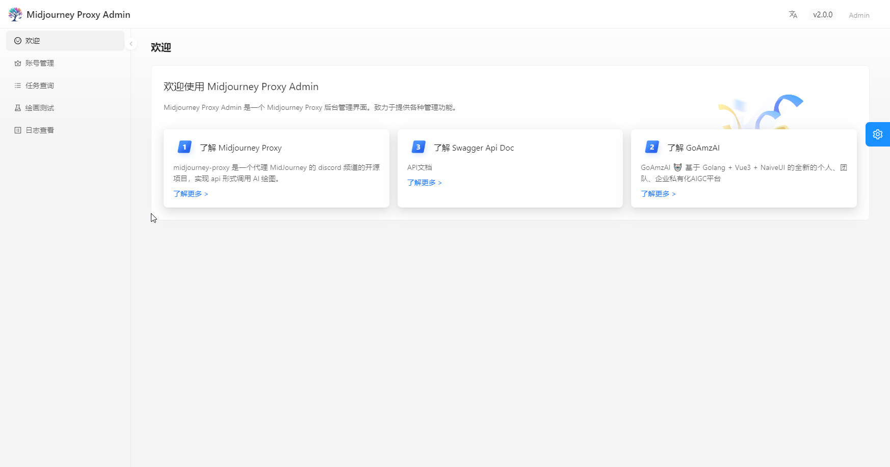
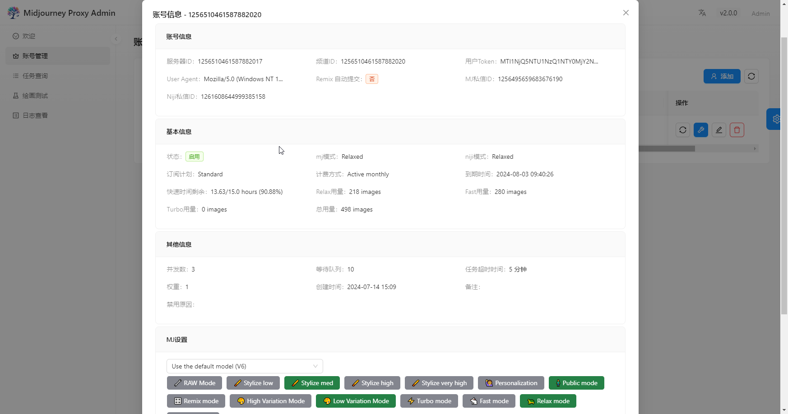
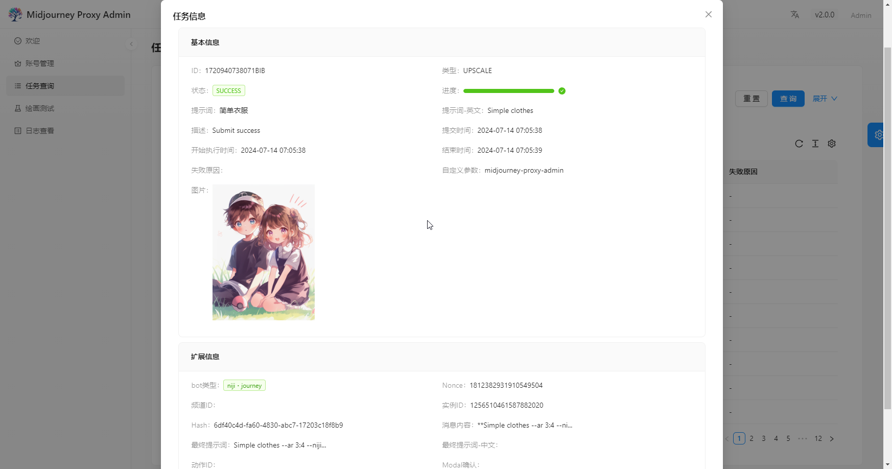
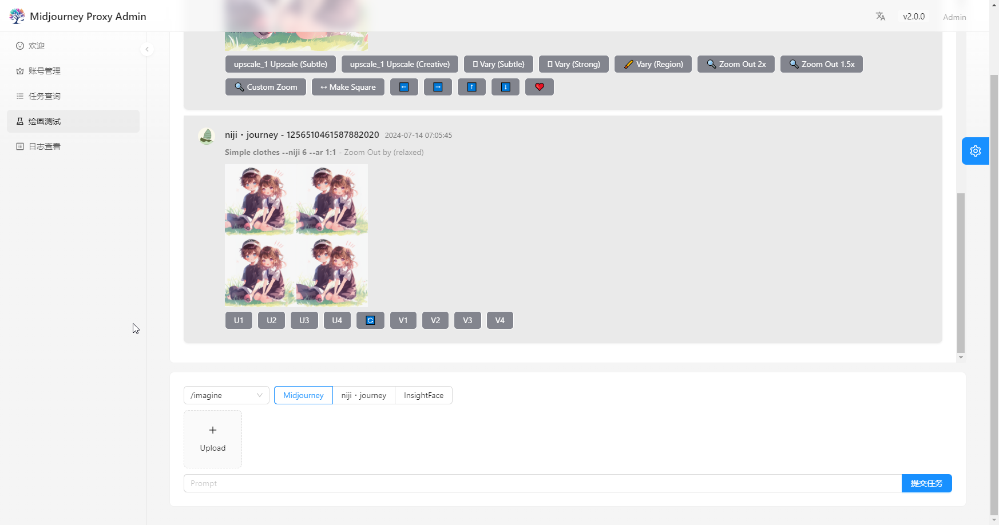
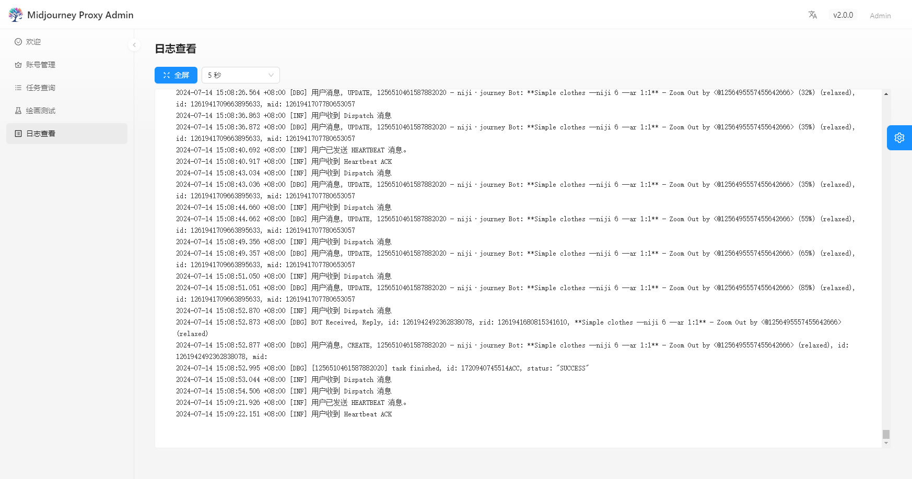
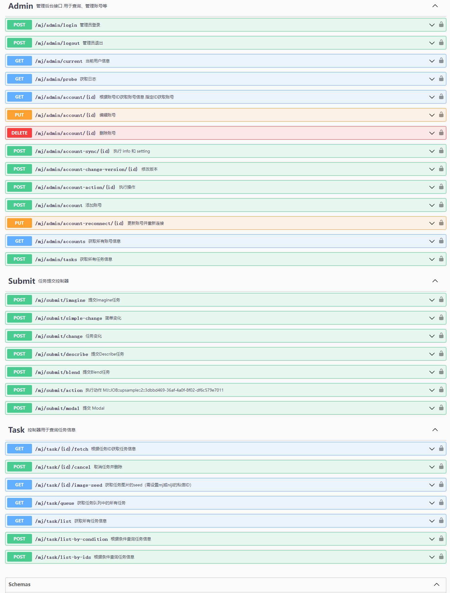
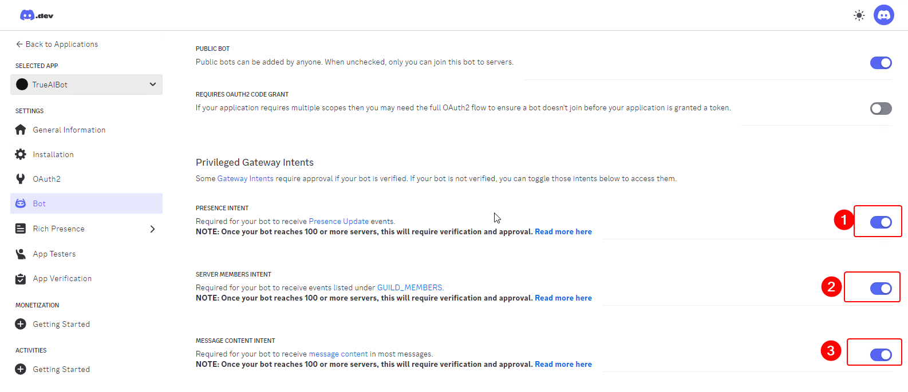
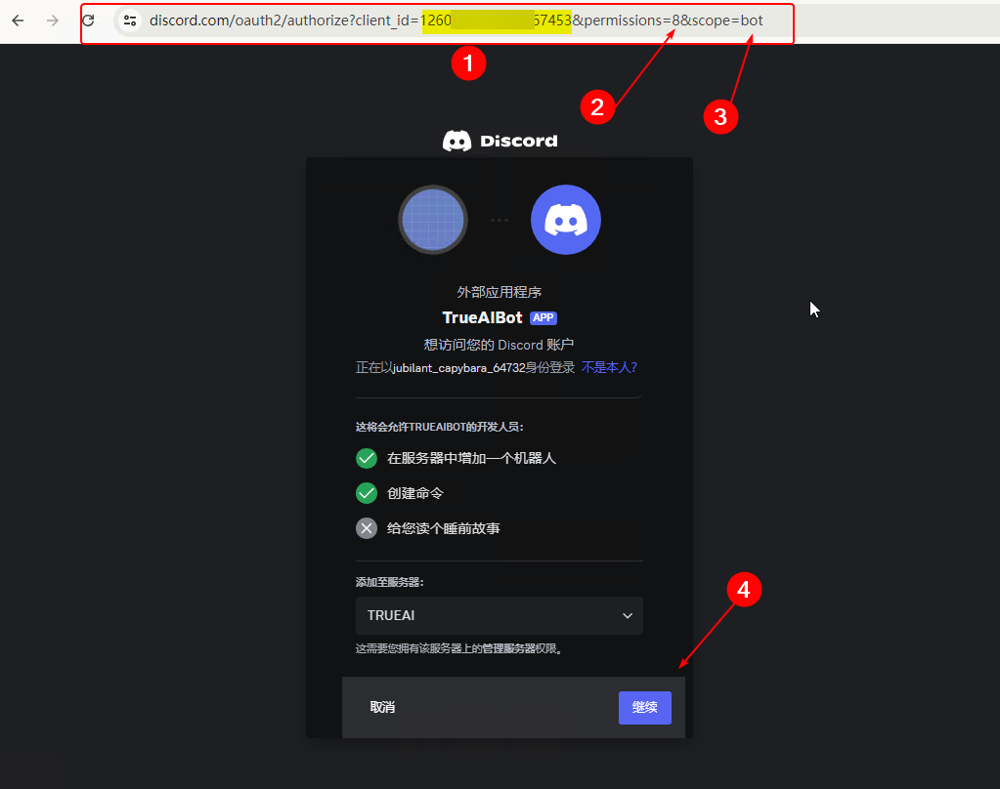

# Midjourney Proxy

**中文** | [English](README.en.md)

代理 Midjourney 的 Discord 频道，实现 API 形式调用 AI 绘图，公益项目，提供绘图 API 免费使用。

完全开源，不会存在部分开源或部分闭源，欢迎 PR。

功能最全、最安全、占用内存最小（100MB+）的 Midjourney Proxy API ~~

非常感谢各位的帮助和支持，感谢诸多大佬对本项目提供了很多赞助和支持，万分感谢！

## 交流群

由于目前文档不是很完善，使用上和部署上可能会有问题，欢迎加入交流群，一起讨论和解决问题。

[Midjourney公益群](https://qm.qq.com/q/k88clCkyMS)（QQ群：565908696）


## 主要功能

- [x] 支持 Imagine 指令和相关动作 [V1/V2.../U1/U2.../R]
- [x] Imagine 时支持添加图片 base64，作为垫图
- [x] 支持 Blend (图片混合)、Describe (图生文) 指令
- [x] 支持任务实时进度
- [x] 支持中文 prompt 翻译，需配置百度翻译
- [x] prompt 敏感词预检测，支持覆盖调整
- [x] user-token 连接 wss，可以获取错误信息和完整功能
- [x] 支持 Shorten(prompt分析) 指令
- [x] 支持焦点移动：Pan ⬅️➡⬆️⬇️
- [x] 支持局部重绘：Vary (Region) 🖌
- [x] 支持几乎所有的关联按钮动作
- [x] 支持图片变焦，自定义变焦 Zoom 🔍
- [x] 支持获取图片的 seed 值
- [x] 支持账号指定生成速度模式 RELAX | FAST | TURBO 
- [x] 支持多账号配置，每个账号可设置对应的任务队列，支持账号选择模式 BestWaitIdle | Random | Weight | Polling
- [x] 账号池持久化，动态维护
- [x] 支持获取账号 /info、/settings 信息
- [x] 账号 settings 设置
- [x] 支持 niji・journey Bot 和 Midjourney Bot
- [x] zlib-stream 安全压缩传输 <https://discord.com/developers/docs/topics/gateway>
- [x] 内嵌MJ管理后台页面，支持多语言 <https://github.com/trueai-org/midjourney-proxy-webui>
- [x] 支持MJ账号的增删改查功能
- [x] 支持MJ账号的详细信息查询和账号同步操作
- [x] 支持MJ账号的并发队列设置
- [x] 支持MJ的账号settings设置
- [x] 支持MJ的任务查询
- [x] 提供功能齐全的绘图测试页面
- [x] 兼容支持市面上主流绘图客户端和 API 调用
- [x] 任务增加父级任务信息等
- [x] 🎛️ Remix 模式和 Remix 模式自动提交
- [x] 内置图片保存到本地、内置 CDN 加速
- [x] 绘图时当未读消息过多时，自动模拟读未读消息
- [x] 图生文之再生图 PicReader、Picread 指令支持，以及批量再生图指令支持（无需 fast 模式）
- [x] 支持 BOOKMARK 等指令
- [x] 支持指定实例绘图，支持过滤指定速度的账号绘图，支持过滤 `remix` 模式账号绘图等，详情参考 Swagger `accountFilter` 字段
- [x] 逆向根据 job id 或 图片生成系统任务信息
- [x] 支持账号排序、并行数、队列数、最大队列数、任务执行间隔等配置
- [x] 支持客户端路径指定模式，默认地址例子 https://{BASE_URL}/mj/submit/imagine, /mj-turbo/mj 是 turbo mode, /mj-relax/mj 是 relax mode, /mj-fast/mj 是 fast mode, /mj 不指定模式
- [x] CloudFlare 手动真人验证，触发后自动锁定账号，通过 GUI 直接验证或通过邮件通知验证
- [x] CloudFlare 自动真人验证，配置验证服务器地址（自动验证器仅支持 Windows 部署）
- [x] 支持工作时间段配置，连续 24 小时不间断绘图可能会触发警告，建议休息 8~10 小时，示例：`09:10-23:55, 13:00-08:10`
- [x] 内置 IP 限流、IP 段限流、黑名单、白名单、自动黑名单等功能
- [x] 单日绘图上限支持，超出上限后自动停止绘图
- [x] 开启注册、开启访客
- [x] 可视化配置功能
- [x] 支持 Swagger 文档独立开启
- [x] 配置机器人 Token 可选配置，不配置机器人也可以使用
- [x] 优化指令和状态进度显示
- [x] 摸鱼时间配置，账号增加咸鱼模式/放松模式，避免高频作业（此模式下不可创建新的绘图，仍可以执行其他命令，可以配置为多个时间段等策略）
- [x] 账号垂直分类支持，账号支持词条配置，每个账号只做某一类作品，例如：只做风景、只做人物
- [ ] 允许共享频道或子频道绘画，即便账号被封，也可以继续之前的绘画，将被封的账号频道作为正常账号的子频道即可，保存永久邀请链接，和子频道链接，支持批量修改，可直接输入邀请链接，或共享频道地址，系统自动加入频道转换。或者通过转交所有权实现。
- [ ] 征集一个视频教程
- [ ] 支持 `mjplus` 或其他服务一键迁移到本服务

## 在线预览

公益接口为慢速模式，接口免费调用，账号池由赞助者提供，请大家合理使用。

- 管理后台：<https://ai.trueai.org>
- 账号密码：`无`
- 公益接口：<https://ai.trueai.org/mj>
- 接口文档：<https://ai.trueai.org/swagger>
- 接口密钥：`无`
- CF 自动验证服务器地址：<http://47.76.110.222:8081>
- CF 自动验证服务器文档：<http://47.76.110.222:8081/swagger>

> CF 自动验证配置示例（免费自动过人机验证）

```json
"CaptchaServer": "http://47.76.110.222:8081",
"CaptchaNotifyHook": "https://ai.trueai.org" // 通知回调，默认为当前域名
```

## 预览截图













## 客户端推荐

- **ChatGPT-Midjourney**: <https://github.com/Licoy/ChatGPT-Midjourney>
  - 一键拥有你自己的 ChatGPT+StabilityAI+Midjourney 网页服务 -> <https://chat-gpt-midjourney-96vk.vercel.app/#/mj>
  - 打开网站 -> 设置 -> 自定义接口 -> 模型(Midjourney) -> 接口地址 -> <https://ai.trueai.org/mj>

- **ChatGPT Web Midjourney Proxy**: <https://github.com/Dooy/chatgpt-web-midjourney-proxy> 
  - 打开网站 <https://vercel.ddaiai.com> -> 设置 -> MJ 绘画接口地址 -> <https://ai.trueai.org>

- **GoAmzAI**: <https://github.com/Licoy/GoAmzAI>
  -	打开后台 -> 绘画管理 -> 新增 -> MJ 绘画接口地址 -> <https://ai.trueai.org/mj>

## 安装与使用

### 快速启动

> Docker 版本

**注意：一定确认映射文件和路径不要出错⚠⚠**

```bash
# 阿里云镜像（推荐国内使用）
docker pull registry.cn-guangzhou.aliyuncs.com/trueai-org/midjourney-proxy

# 公益演示站点启动配置示例

# 1.下载并重命名配置文件（示例配置）
# 提示：3.x 版本无需配置文件
wget -O /root/mjopen/appsettings.Production.json https://raw.githubusercontent.com/trueai-org/midjourney-proxy/main/src/Midjourney.API/appsettings.json

# 或使用 curl 下载并重命名配置文件（示例配置）
# 提示：3.x 版本无需配置文件
curl -o /root/mjopen/appsettings.Production.json https://raw.githubusercontent.com/trueai-org/midjourney-proxy/main/src/Midjourney.API/appsettings.json

# 2.停止并移除旧的 Docker 容器
docker stop mjopen && docker rm mjopen

# 3.启动新的 Docker 容器
# 提示：3.x 版本无需配置文件
docker run -m 1g --name mjopen -d --restart=always \
 -p 8086:8080 --user root \
 -v /root/mjopen/logs:/app/logs:rw \
 -v /root/mjopen/data:/app/data:rw \
 -v /root/mjopen/attachments:/app/wwwroot/attachments:rw \
 -v /root/mjopen/ephemeral-attachments:/app/wwwroot/ephemeral-attachments:rw \
 -v /root/mjopen/appsettings.Production.json:/app/appsettings.Production.json:ro \
 -e TZ=Asia/Shanghai \
 -v /etc/localtime:/etc/localtime:ro \
 -v /etc/timezone:/etc/timezone:ro \
 registry.cn-guangzhou.aliyuncs.com/trueai-org/midjourney-proxy

# 生产环境启动配置示例
docker run --name mjopen -d --restart=always \
 -p 8086:8080 --user root \
 -v /root/mjopen/logs:/app/logs:rw \
 -v /root/mjopen/data:/app/data:rw \
 -v /root/mjopen/attachments:/app/wwwroot/attachments:rw \
 -v /root/mjopen/ephemeral-attachments:/app/wwwroot/ephemeral-attachments:rw \
 -v /root/mjopen/appsettings.Production.json:/app/appsettings.Production.json:ro \
 -e TZ=Asia/Shanghai \
 -v /etc/localtime:/etc/localtime:ro \
 -v /etc/timezone:/etc/timezone:ro \
 registry.cn-guangzhou.aliyuncs.com/trueai-org/midjourney-proxy

# GitHub 镜像
docker pull ghcr.io/trueai-org/midjourney-proxy
docker run --name mjopen -d --restart=always \
 -p 8086:8080 --user root \
 -v /root/mjopen/logs:/app/logs:rw \
 -v /root/mjopen/data:/app/data:rw \
 -v /root/mjopen/attachments:/app/wwwroot/attachments:rw \
 -v /root/mjopen/ephemeral-attachments:/app/wwwroot/ephemeral-attachments:rw \
 -v /root/mjopen/appsettings.Production.json:/app/appsettings.Production.json:ro \
 -e TZ=Asia/Shanghai \
 -v /etc/localtime:/etc/localtime:ro \
 -v /etc/timezone:/etc/timezone:ro \
 ghcr.io/trueai-org/midjourney-proxy

# DockerHub 镜像
docker pull trueaiorg/midjourney-proxy
docker run --name mjopen -d --restart=always \
 -p 8086:8080 --user root \
 -v /root/mjopen/logs:/app/logs:rw \
 -v /root/mjopen/data:/app/data:rw \
 -v /root/mjopen/attachments:/app/wwwroot/attachments:rw \
 -v /root/mjopen/ephemeral-attachments:/app/wwwroot/ephemeral-attachments:rw \
 -v /root/mjopen/appsettings.Production.json:/app/appsettings.Production.json:ro \
 -e TZ=Asia/Shanghai \
 -v /etc/localtime:/etc/localtime:ro \
 -v /etc/timezone:/etc/timezone:ro \
 trueaiorg/midjourney-proxy
```

> Windows 版本

```bash
a. 通过 https://github.com/trueai-org/midjourney-proxy/releases 下载 windows 最新免安装版，例如：midjourney-proxy-win-x64.zip
b. 解压并执行 Midjourney.API.exe
c. 打开网站 http://localhost:8080
d. 部署到 IIS（可选），在 IIS 添加网站，将文件夹部署到 IIS，配置应用程序池为`无托管代码`，启动网站。
e. 使用系统自带的 `任务计划程序`（可选），创建基本任务，选择 `.exe` 程序即可，请选择`请勿启动多个实例`，保证只有一个任务执行即可。
```

> Linux 版本

```bash
a. 通过 https://github.com/trueai-org/midjourney-proxy/releases 下载 linux 最新免安装版，例如：midjourney-proxy-linux-x64.zip
b. 解压到当前目录: tar -xzf midjourney-proxy-linux-x64-<VERSION>.tar.gz
c. 执行: run_app.sh
c. 启动方式1: sh run_app.sh
d. 启动方式2: chmod +x run_app.sh && ./run_app.sh
```

> macOS 版本

```bash
a. 通过 https://github.com/trueai-org/midjourney-proxy/releases 下载 macOS 最新免安装版，例如：midjourney-proxy-osx-x64.zip
b. 解压到当前目录: tar -xzf midjourney-proxy-osx-x64-<VERSION>.tar.gz
c. 执行: run_app_osx.sh
c. 启动方式1: sh run_app_osx.sh
d. 启动方式2: chmod +x run_app_osx.sh && ./run_app_osx.sh
```

> Linux 一键安装脚本（❤感谢 [@dbccccccc](https://github.com/dbccccccc)）

```bash
# 方式1
wget -N --no-check-certificate https://raw.githubusercontent.com/trueai-org/midjourney-proxy/main/scripts/linux_install.sh && chmod +x linux_install.sh && bash linux_install.sh

# 方式2
curl -o linux_install.sh https://raw.githubusercontent.com/trueai-org/midjourney-proxy/main/scripts/linux_install.sh && chmod +x linux_install.sh && bash linux_install.sh
```

## 参数配置

- `appsettings.json` 默认配置
- `appsettings.Production.json` 生产环境配置
- `/app/data` 数据目录，存放账号、任务等数据
    - `/app/data/mj.db` 数据库文件
- `/app/logs` 日志目录
- `/app/wwwroot` 静态文件目录
    - `/app/wwwroot/attachments` 绘图文件目录
    - `/app/wwwroot/ephemeral-attachments` describe 生成图片目录

#### 角色说明

- `普通用户`：只可用于绘图接口，无法登录后台。
- `管理员`：可以登录后台，可以查看任务、配置等。

#### 默认用户说明

- 启动站点，如果之前没有设置过 `AdminToken`，则默认管理员 token 为：`admin`

> 3.x 版本，无需此配置，修改配置请通过 GUI 修改

```json
{
  "Demo": null, // 网站配置为演示模式
  "UserToken": "", // 用户绘画令牌 token，可以用来访问绘画接口，可以不用设定
  "AdminToken": "", // 管理后台令牌 token，可以用来访问绘画接口和管理员账号等功能
  "mj": {
    "AccountChooseRule": "BestWaitIdle", // BestWaitIdle | Random | Weight | Polling = 最佳空闲规则 | 随机 | 权重 | 轮询
    "Discord": { // Discord 配置，默认可以为 null
      "GuildId": "125652671***", // 服务器 ID
      "ChannelId": "12565267***", // 频道 ID
      "PrivateChannelId": "1256495659***", // MJ 私信频道 ID，用来接受 seed 值
      "NijiBotChannelId": "1261608644***", // NIJI 私信频道 ID，用来接受 seed 值
      "UserToken": "MTI1NjQ5N***", // 用户 token
      "BotToken": "MTI1NjUyODEy***", // 机器人 token
      "UserAgent": "Mozilla/5.0 (Macintosh; Intel Mac OS X 10_15_7) AppleWebKit/537.36 (KHTML, like Gecko) Chrome/112.0.0.0 Safari/537.36",
      "Enable": true, // 是否默认启动
      "CoreSize": 3, // 并发数
      "QueueSize": 10, // 队列数
      "MaxQueueSize": 100, // 最大队列数
      "TimeoutMinutes": 5, // 任务超时分钟数
      "Mode": null, // RELAX | FAST | TURBO 指定生成速度模式 --fast, --relax, or --turbo parameter at the end.
      "Weight": 1 // 权重
    },
    "NgDiscord": { // NG Discord 配置，默认可以为 null
      "Server": "",
      "Cdn": "",
      "Wss": "",
      "ResumeWss": "",
      "UploadServer": "",
      "SaveToLocal": false, // 是否开启图片保存到本地，如果开启则使用本地部署的地址，也可以同时配置 CDN 地址
      "CustomCdn": "" // 如果不填写，并且开启了保存到本地，则默认为根目录，建议填写自己的域名地址
    },
    "Proxy": { // 代理配置，默认可以为 null
      "Host": "",
      "Port": 10809
    },
    "Accounts": [], // 账号池配置
    "BaiduTranslate": { // 百度翻译配置，默认可以为 null
      "Appid": "", // your_appid
      "AppSecret": "" // your_app_secret
    },
    "TranslateWay": "NULL", // NULL | GTP | BAIDU, 翻译配置, 默认: NULL
    "ApiSecret": "", // your_api_secret
    "NotifyHook": "", // your_notify_hook, 回调配置
    "NotifyPoolSize": 10,
    "Smtp": {
      "Host": "smtp.mxhichina.com", // SMTP服务器信息
      "Port": 465, // SMTP端口，一般为587或465，具体依据你的SMTP服务器而定
      "EnableSsl": true, // 根据你的SMTP服务器要求设置
      "FromName": "system", // 发件人昵称
      "FromEmail": "system@***.org", // 发件人邮箱地址
      "FromPassword": "", // 你的邮箱密码或应用专用密码
      "To": "" // 收件人
    },
    "CaptchaServer": "", // CF 验证服务器地址
    "CaptchaNotifyHook": "" // CF 验证通知地址（验证通过后的回调通知，默认就是你的当前域名）
  },
  // IP/IP 段 限流配置，可以用来限制某个 IP/IP 段 的访问频率
  // 触发限流后会返回 429 状态码
  // 黑名单直接返回 403 状态码
  // 黑白名、白名单支持 IP 和 CIDR 格式 IP 段，例如：192.168.1.100、192.168.1.0/24
  "IpRateLimiting": {
    "Enable": false,
    "Whitelist": [], // 永久白名单 "127.0.0.1", "::1/10", "::1"
    "Blacklist": [], // 永久黑名单
    "IpRules": {
      // 限制 mj/submit 接口下的所有接口
      "*/mj/submit/*": {
        "3": 1, // 每 3 秒 最多访问 1 次
        "60": 6, // 每 60 秒最多访问 6 次
        "600": 20, // 每 600 秒最多访问 20 次
        "3600": 60, // 每 3600 秒最多访问 60 次
        "86400": 120 // 每天最多访问 120 次
      }
    },
    "IpRangeRules": {
      // 限制 mj/submit 接口下的所有接口
      "*/mj/submit/*": {
        "5": 10, // 每 5 秒 最多访问 10 次
        "60": 30, // 每 60 秒最多访问 30 次
        "600": 100, // 每 600 秒最多访问 100 次
        "3600": 300, // 每 3600 秒最多访问 300 次
        "86400": 360 // 每天最多访问 360 次
      }
    }
  },
  // IP 黑名单限流配置，触发后自动封锁 IP，支持封锁时间配置
  // 触发限流后，加入黑名单会返回 403 状态码
  // 黑白名、白名单支持 IP 和 CIDR 格式 IP 段，例如：192.168.1.100、192.168.1.0/24
  "IpBlackRateLimiting": {
    "Enable": false,
    "Whitelist": [], // 永久白名单 "127.0.0.1", "::1/10", "::1"
    "Blacklist": [], // 永久黑名单
    "BlockTime": 1440, // 封锁时间，单位：分钟
    "IpRules": {
      "*/mj/*": {
        "1": 30,
        "60": 900
      }
    },
    "IpRangeRules": {
      "*/mj/*": {
        "1": 90,
        "60": 3000
      }
    }
  },
  "Serilog": {
    "MinimumLevel": {
      "Default": "Information",
      "Override": {
        "Default": "Warning",
        "System": "Warning",
        "Microsoft": "Warning"
      }
    },
    "WriteTo": [
      {
        "Name": "File",
        "Args": {
          "path": "logs/log.txt",
          "rollingInterval": "Day",
          "fileSizeLimitBytes": null,
          "rollOnFileSizeLimit": false,
          "retainedFileCountLimit": 31
        }
      },
      {
        "Name": "Console"
      }
    ]
  },
  "Logging": {
    "LogLevel": {
      "Default": "Information",
      "Microsoft.AspNetCore": "Warning"
    }
  },
  "AllowedHosts": "*",
  "urls": "http://*:8080" // 默认端口
}
```

## CloudFlare 验证器部署

仅支持 Windows 部署（并且支持 TLS 1.3，系统要求 Windows11 或 Windows Server 2022），由于 CloudFlare 验证器需要使用到 Chrome 浏览器，所以需要在 Windows 环境下部署，而在 Linux 环境下部署会依赖很多库，所以暂时不支持 Linux 部署。

注意：自行部署需提供 2captcha.com 的 API Key，否则无法使用，价格：1000次/9元，官网：<https://2captcha.cn/p/cloudflare-turnstile>

提示：首次启动会下载 Chrome 浏览器，会比较慢，请耐心等待。

> `appsettings.json` 配置参考

```json
{
  "Demo": null, // 网站配置为演示模式
  "Captcha": {
    "Headless": true, // chrome 是否后台运行
    "TwoCaptchaKey": "" // 2captcha.com 的 API Key
  },
  "urls": "http://*:8081" // 默认端口
}

```

## 机器人 Token（可选配置）

本项目利用 Discord 机器人 Token 连接 wss，可以获取错误信息和完整功能，确保消息的高可用性等问题。

```
1. 创建应用
https://discord.com/developers/applications

2. 设置应用权限（确保拥有读取内容权限，参考截图）
[Bot] 设置 -> 全部开启

3. 添加应用到频道服务器（参考截图）

client_id 可以在应用详情页找到，为 APPLICATION ID

https://discord.com/oauth2/authorize?client_id=xxx&permissions=8&scope=bot

4. 复制或重置 Bot Token 到配置文件
```

设置应用权限（确保拥有读取内容权限，参考截图）



添加应用到频道服务器（参考截图）



## 相关文档
1. [API接口说明](./docs/api.md)

## 路线图

- [ ] 优化任务和队列满时的提醒
- [ ] 优化共享账号的并发队列可能出现的问题
- [ ] 内置词库管理，批量修改
- [ ] 接入官网绘图 API 支持
- [ ] 增加统计面板、绘图统计、访客统计
- [ ] 内置用户体系、可注册可管理、限流、最大次数等
- [ ] GPT 翻译接入
- [ ] 最终提示词增加翻译中文显示支持
- [ ] 账号支持单独的代理
- [ ] 多数据库支持 MySQL、Sqlite、SqlServer、MongoDB、PostgeSQL、Redis 等
- [ ] 支付接入支持、支持微信、支付宝，支持绘图定价策略等
- [ ] 增加公告功能
- [ ] 图生文 seed 值处理
- [ ] 自动读私信消息
- [ ] 多账号分组支持、多账号分页支持
- [ ] 服务重启后，如果有未启动的任务，则加入到执行的队列中

## 支持与赞助

- 如果觉得这个项目对您有所帮助，请帮忙点个 Star⭐
- 您也可以提供暂时空闲的绘画公益账号（赞助 1 个慢速队列），支持此项目的发展😀