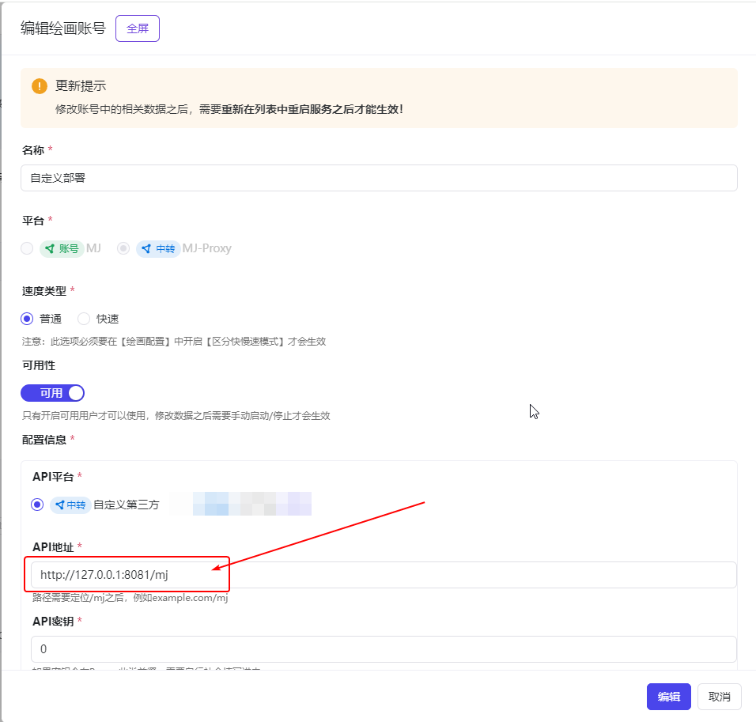

# Midjourney Proxy

Proxy Midjourney's Discord channel to implement API-based AI drawing calls. This is a public welfare project offering free drawing API usage.

Fully open-source with no partial open-source or closed-source components. Contributions are welcome.

The most comprehensive, secure, and memory-efficient (100MB+) Midjourney Proxy API ~~

### Main Features

- [x] Supports Imagine command and related actions [V1/V2.../U1/U2.../R]
- [x] Supports adding images in base64 format as a base for Imagine
- [x] Supports Blend (image mixing), Describe (image to text) commands
- [x] Real-time task progress
- [x] Chinese prompt translation, requires Baidu translation configuration
- [x] Prompt sensitive word pre-detection with support for adjustments
- [x] user-token connects to wss for error information and complete functionality
- [x] Supports Shorten (prompt analysis) command
- [x] Supports focus movement: Pan ⬅️➡⬆️⬇️
- [x] Supports partial redrawing: Vary (Region) 🖌
- [x] Supports almost all associated button actions and 🎛️ Remix mode
- [x] Supports image zoom, custom zoom Zoom 🔍
- [x] Retrieve image seed value
- [x] Supports account-specific speed modes RELAX | FAST | TURBO
- [x] Multi-account configuration, each account can set its own task queue, supports account selection modes BestWaitIdle | Random | Weight | Polling
- [x] Persistent account pool with dynamic maintenance
- [x] Retrieve account /info, /settings information
- [x] Account settings
- [x] Supports niji・journey Bot and Midjourney Bot
- [x] Secure zlib-stream transmission <https://discord.com/developers/docs/topics/gateway>
- [x] Embedded MJ management backend page, supports multiple languages <https://github.com/trueai-org/midjourney-proxy-webui>
- [x] Supports CRUD operations on MJ accounts
- [x] Detailed account information queries and account synchronization operations
- [x] Account concurrency queue settings
- [x] MJ task queries
- [x] Comprehensive drawing test page
- [x] Compatible with mainstream drawing clients and API calls.

### Online Preview

The public welfare interface operates in slow mode, free for calling. The account pool is provided by sponsors, please use it reasonably.

- Management Backend: <https://ai.trueai.org>
- Username/Password: `None`
- Public Interface: <https://ai.trueai.org/mj>
- API Documentation: <https://ai.trueai.org/swagger>
- API Key: `None`

### Preview Screenshots


### Recommended Clients

- **ChatGPT Web Midjourney Proxy**: <https://github.com/Dooy/chatgpt-web-midjourney-proxy>
  - Open the website <https://vercel.ddaiai.com> -> Settings -> MJ drawing interface address -> <https://ai.trueai.org>

- **GoAmzAI**: <https://github.com/Licoy/GoAmzAI>
  - Open the backend -> Drawing Management -> Add -> MJ drawing interface address -> <https://ai.trueai.org/mj>

### Configuration Options

- mj.accounts: Refer to [Account Pool Configuration](./docs/config.md#%E8%B4%A6%E5%8F%B7%E6%B1%A0%E9%85%8D%E7%BD%AE%E5%8F%82%E8%80%83)
- mj.task-store.type: Task storage method, default is in_memory (lost after restart), optional redis
- mj.task-store.timeout: Task storage expiration time, tasks are deleted after expiration, default is 30 days
- mj.api-secret: API secret, does not enable authentication if empty; add request header mj-api-secret when calling the API
- mj.translate-way: Method to translate Chinese prompts to English, options are null (default), baidu, gpt
- More configurations see [Configuration Items](./docs/config.md)

### Installation and Usage

#### Quick Start

> Docker Version

```bash
# Alibaba Cloud Mirror (recommended for domestic use)
docker pull registry.cn-guangzhou.aliyuncs.com/trueai-org/midjourney-proxy

# Example of starting a public welfare demonstration site
docker run --name mjopen -d --restart=always \
 -e DEMO=true \
 -p 8086:8080 --user root \
 -v /root/mjopen/logs:/app/logs:rw \
 -v /root/mjopen/data:/app/data:rw \
 -v /root/mjopen/appsettings.Production.json:/app/appsettings.Production.json:ro \
 -e TZ=Asia/Shanghai \
 -v /etc/localtime:/etc/localtime:ro \
 -v /etc/timezone:/etc/timezone:ro \
 registry.cn-guangzhou.aliyuncs.com/trueai-org/midjourney-proxy

# Example of starting a production environment
docker pull registry.cn-guangzhou.aliyuncs.com/trueai-org/midjourney-proxy
docker run --name mjapi -d --restart=always \
 -p 8082:8080 --user root \
 -v /root/mjapi/logs:/app/logs:rw \
 -v /root/mjapi/data:/app/data:rw \
 -v /root/mjapi/appsettings.Production.json:/app/appsettings.Production.json:ro \
 -e TZ=Asia/Shanghai \
 -v /etc/localtime:/etc/localtime:ro \
 -v /etc/timezone:/etc/timezone:ro \
 registry.cn-guangzhou.aliyuncs.com/trueai-org/midjourney-proxy
```

> Configuration Usage

After starting the docker, configure the proxy to `http://127.0.0.1:8086/mj`



### Bot Token (must be configured)

This project uses the Discord bot token to connect to wss for error information and full functionality.

```
1. Create an application
https://discord.com/developers/applications

2. Set application permissions (ensure read content permissions, refer to the screenshot)
[Bot] Settings -> Enable all

3. Add application to channel server (refer to the screenshot)

client_id can be found on the application details page, it's the APPLICATION ID

https://discord.com/oauth2/authorize?client_id=xxx&permissions=8&scope=bot

4. Copy or reset the Bot Token to the configuration file
```

Set application permissions (ensure read content permissions, refer to the screenshot)


Add application to channel server (refer to the screenshot)


### Related Documentation

1. [API Interface Description](./docs/api.md)

### Support and Sponsorship

- If you find this project helpful, please give it a Star⭐
- You can also provide temporarily unused drawing public accounts to support this project's development😀

### Links

- https://github.com/dolfies/discord.py-self
- https://github.com/bao-io/midjourney-sdk
- https://github.com/webman-php/midjourney-proxy
- https://github.com/novicezk/midjourney-proxy
- https://github.com/litter-coder/midjourney-proxy-plus
- https://github.com/Dooy/chatgpt-web-midjourney-proxy
- https://github.com/erictik/midjourney-api
- https://github.com/yokonsan/midjourney-api
- https://github.com/imagineapi/imagineapi

### Common Links

- Open AI: <https://openai.com>
- Discord: <https://discord.com>
- Discord Developer Platform: <https://discord.com/developers/applications>
- Wenxin Yiyan: <https://cloud.baidu.com/product/wenxinworkshop>
- Xinghuo Model: <https://xinghuo.xfyun.cn/>
- Api2d: <https://api2d.com/>
- OpenAI-SB: <https://www.openai-sb.com>
- Baota: <https://bt.cn>
- Alibaba Cloud: <https://aliyun.com>
- Tencent Cloud: <https://cloud.tencent.com/>
- SMS Bao: <http://www.smsbao.com/>
- OneAPI Project: <https://github.com/songquanpeng/one-api>